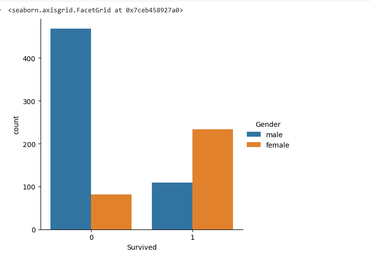

# Suriya prakash
# 212223100055

# EX 02 DS
# AIM:
      To perform Exploratory Data Analysis on the given data set.
      
# EXPLANATION:
  The primary aim with exploratory analysis is to examine the data for distribution, outliers and anomalies to direct specific testing of your hypothesis.
  
# ALGORITHM:
STEP 1: Import the required packages to perform Data Cleansing,Removing Outliers and Exploratory Data Analysis.

STEP 2: Replace the null value using any one of the method from mode,median and mean based on the dataset available.

STEP 3: Use boxplot method to analyze the outliers of the given dataset.

STEP 4: Remove the outliers using Inter Quantile Range method.

STEP 5: Use Countplot method to analyze in a graphical method for categorical data.

STEP 6: Use displot method to represent the univariate distribution of data.

STEP 7: Use cross tabulation method to quantitatively analyze the relationship between multiple variables.

STEP 8: Use heatmap method of representation to show relationships between two variables, one plotted on each axis.

## CODING AND OUTPUT
```
import pandas as pd
import numpy as np
import matplotlib.pyplot as plt
import seaborn as sns
dt=pd.read_csv("/titanic_dataset.csv")
dt
```


```
dt.info()
```


```
dt.set_index("PassengerId",inplace=True)
dt.describe()
```


```
dt.nunique()
```


```
dt["Survived"].value_counts()
per=(dt["Survived"].value_counts()/dt.shape[0]*100).round(2)
per
```


```
sns.countplot(data=dt,x="Survived")
```


```
dt
```


```
dt.Pclass.unique()
dt.rename(columns={'Sex':'Gender'},inplace=True)
dt
```


```
sns.catplot(x="Gender",col="Survived",kind="count",data=dt,height=5,aspect=.7)
```


```
sns.catplot(x="Survived",hue="Gender",data=dt,kind="count")
```



```
dt.boxplot(column="Age",by="Survived")
```


```
sns.scatterplot(x=dt["Age"],y=dt["Fare"])
```


```
sns.jointplot(x="Age",y="Fare",data=dt)
```


```
fig,ax1=plt.subplots(figsize=(8,5))
pt=sns.boxplot(ax=ax1,x="Pclass",y="Age",hue="Gender",data=dt)
```


```
sns.catplot(data=dt,col="Survived",x="Gender",hue="Pclass",kind="count")
```


```
numeric_data = dt.select_dtypes(include=[np.number])
corr = numeric_data.corr()
sns.heatmap(corr, annot=True)
plt.show()
```


```
sns.pairplot(dt)
```


# RESULT

Hence performing Exploratory Data Analysis on the given data set is successfully executed.
        
